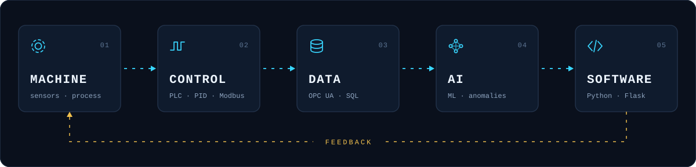

  

I'm an engineering student at **Polytech Marseille** (Industrial Engineering & Computer Science), working where industrial systems meet software.

I work across the whole loop rather than a single layer: the physical process, the controller that drives it, the data it produces, and the software that turns that data into decisions and sends them back to the machine.

  

## Stack

<table>
  <tr><td><b>Software</b></td><td>Python · TypeScript · SQL · FastAPI · Flask · React · SQLAlchemy</td></tr>
  <tr><td><b>Data</b></td><td>Pandas · NumPy · Matplotlib</td></tr>
  <tr><td><b>AI&nbsp;&amp;&nbsp;analytics</b></td><td>scikit-learn · PCA · regression · anomaly detection · LLM APIs</td></tr>
  <tr><td><b>Automation&nbsp;&amp;&nbsp;control</b></td><td>PLC (Delta) · CODESYS · PID control · MATLAB / Simulink</td></tr>
  <tr><td><b>Industrial&nbsp;systems</b></td><td>OPC UA · Modbus · Ignition (SCADA)</td></tr>
  <tr><td><b>3D&nbsp;&amp;&nbsp;simulation</b></td><td>Open3D · three.js · 3D Slicer · ANSYS</td></tr>
  <tr><td><b>Tools</b></td><td>Git · GitHub · VS Code</td></tr>
</table>

## Selected work

<table>
  <tr>
    <td><b><a href="https://github.com/achrafelhani/mandible-ssm">MandibleSSM</a></b> 3D · DATA · SOFTWARE</td>
    <td>Web platform for statistical shape modeling of human mandibles: FPFH / RANSAC / ICP correspondence, PCA shape modes, and leave-one-out model evaluation. FastAPI, React, Open3D.</td>
  </tr>
  <tr>
    <td><b><a href="https://github.com/achrafelhani/nutriai">NutriAI</a></b> SOFTWARE · AI</td>
    <td>Nutrition tracking web app: meal logging from text or photos with LLM-based estimation, daily dashboard, 30-day analytics, and a context-aware coach. Flask, SQLAlchemy, JWT.</td>
  </tr>
  <tr>
    <td><b>PolyHeat</b> CONTROL</td>
    <td>Closed-loop thermal regulation on a Delta PLC: PID control, Modbus communication, HMI, and a MATLAB / Simulink model of the process.</td>
  </tr>
  <tr>
    <td><b>SCADA&nbsp;monitoring</b> INDUSTRIAL SYSTEMS</td>
    <td>Supervision built on CODESYS and Ignition over OPC UA, with SQL historization, alarms, and condition-based maintenance.</td>
  </tr>
  <tr>
    <td><b>Industrial&nbsp;data&nbsp;analytics</b> DATA · AI</td>
    <td>Excel / CSV ingestion with Pandas, KPI computation, MAD-based anomaly detection, regression, dashboards, and reporting.</td>
  </tr>
</table>

## Connect

[LinkedIn](https://www.linkedin.com/in/achrafelhani) · Marseille, France

  

