  

I'm an engineering student at **Polytech Marseille** (Industrial Engineering & Computer Science).

I work on the full loop of an intelligent system: the physical process, the control layer that drives it, the data it produces, and the software that turns that data into decisions.

## Stack

| | |
|---|---|
| **Languages** | Python · SQL · MATLAB |
| **Data & AI** | Pandas · NumPy · scikit-learn · Matplotlib |
| **Automation** | PLC (Delta) · CODESYS · Ignition · OPC UA · Modbus · PID control · Simulink |
| **Web & backend** | Flask · SQLAlchemy |
| **3D & simulation** | Open3D · 3D Slicer · ANSYS |
| **Tools** | Git · GitHub · VS Code |
